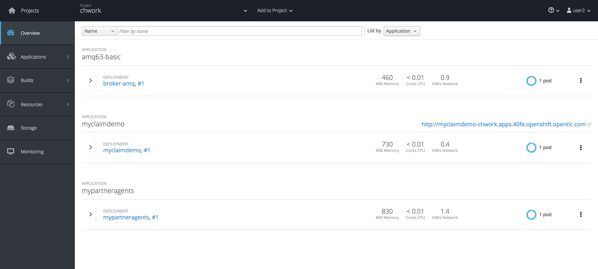

## Setup Tech Spark PoC Environment

Each team will receive an OpenShift SandBox. You will deliver the PoC result in this environment.

Create your own project in the sandbox

```
oc login -u YOUR_USER_ID
oc new-project techspark_YOUR_USER_ID --display-name="Tech Spark PoC" --description="Tech Spark PoC from YOUR_TEAM_NAME - Power by Red Hat Fuse"
```

Setup existing Red Dog application

```  
oc new-app --template=amq63-basic --param=MQ_USERNAME=admin --param=MQ_PASSWORD=admin 

oc create -f soap.yml
oc new-app myclaimdemo
oc create -f batch.yml
oc new-app mypartneragents

```


Here you will be able to test the SOAP application by accessing the WSDL

```  
http://myclaimdemo-YOUR_PROJECT_NAME.apps.YOUR_CLUSTER_ID.openshift.opentlc.com/soap-api/claim?wsdl
```

The Data received from partner helpdesk center has the following parameters:

-	Integer type
-	String contactName
-	String date
-	String phone
-	String email
-	String description

Sample Data: 

```
{"type":2,"contactName":"Mr. Nayeli Hartmann","date":"09-25-1984","phone":"145-833-7824","email":"Kelsie@OKon.com","description":"Dratini at Hearthome City"},
{"type":2,"contactName":"Sofia Huel I","date":"01-27-1965","phone":"1-873-387-5044","email":"Avery@Robel.com","description":"Raticate at Two Island"},
{"type":2,"contactName":"Jordon Klocko","date":"01-29-1955","phone":"643-594-0276","email":"Winifred@Howell.com","description":"Pikachu at Cherrygrove City"},
{"type":2,"contactName":"Madyson Morissette","date":"01-29-1955","phone":"073.832.7998","email":"Sharon@Krajcik.com","description":"Omastar at Aspertia City"}
```

This is what your project will look like after setup. Good Luck and Have FUN!!



To install the rest of the component for the PoCs

```  

oc create -f singlealertapi.yml
oc new-app myaccidentalert


oc create -f batchalert.yml
oc new-app  mybatchalert

oc create -f claimsoaptorest.yml
oc new-app myclaimsoaptorest

oc create -f batchclaim.yml
oc new-app mybatchclaim

```

To test the Single alert report
```
curl -X POST \
  http://YOUR_OSE_PROJECT_HOST/accidentcenter/report \
  -H 'accidentdate: date' \
  -H 'cache-control: no-cache' \
  -H 'contactname: contactName' \
  -H 'description: description' \
  -H 'email: email' \
  -H 'phone: phone' \
  -H 'postman-token: 8a5216b0-d6ba-8262-a8ed-5cdd0b32622a' \
  -H 'type: 1'
```


To test the Claim SOAP to REST

```
curl -X POST \
  http://YOUR_OSE_PROJECT_HOSTpoc/claim/apply \
  -H 'cache-control: no-cache' \
  -H 'content-type: application/json' \
  -H 'postman-token: 1831528d-02fe-9f2a-0e01-3c13c5f040e7' \
  -d '{"applyItem":1,"claimDate":"'\''2018-01-23'\''","claimType":2,"contactPhone":"23458604","customerId":"'\''123456'\''","customerName":"'\''Christina'\''", "email":"'\''test@rh.com'\''","polno":"'\''A23456677'\''"}'
```